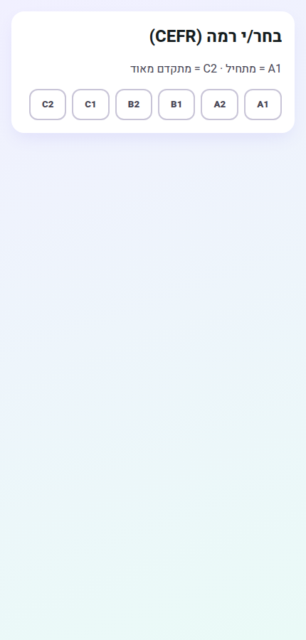
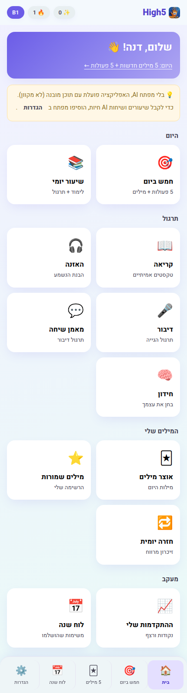
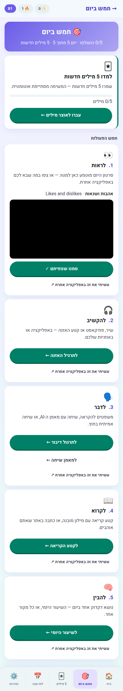
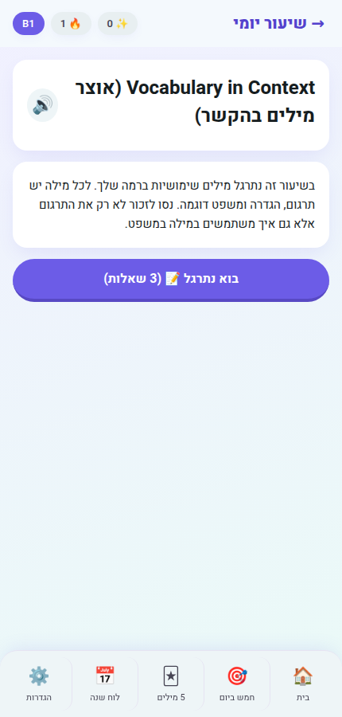
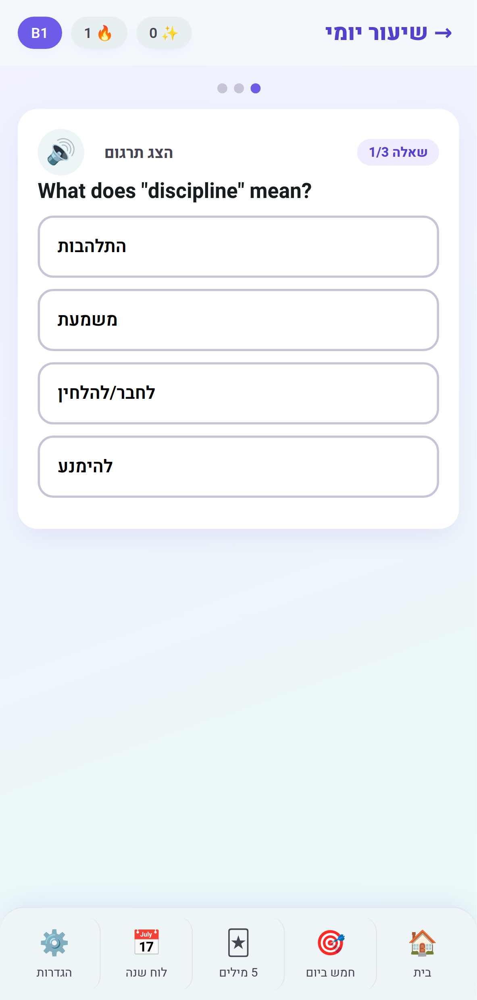
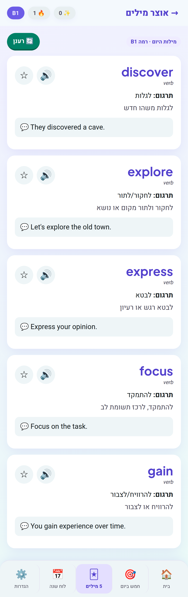
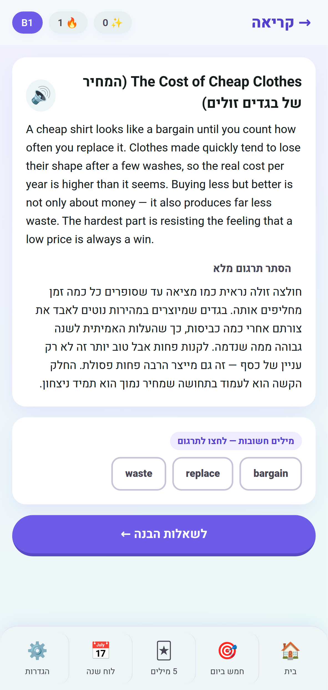
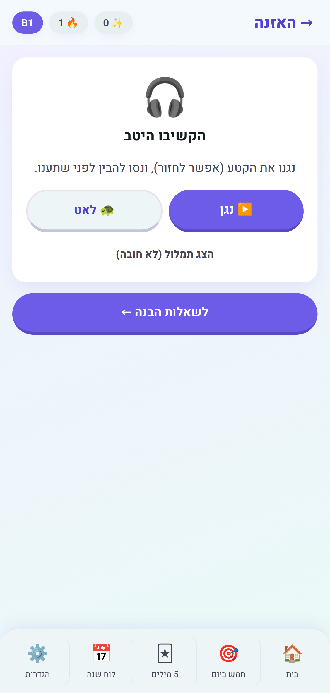
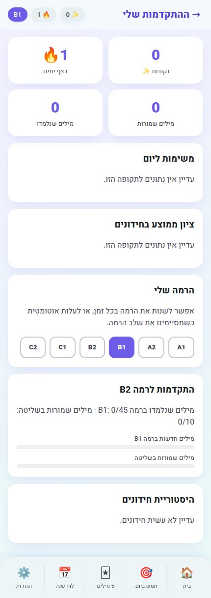
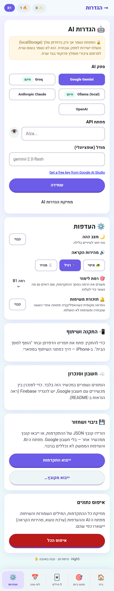

# High5 ✋

A playful **English-learning web app for Hebrew speakers** — daily lessons,
vocabulary flashcards, quizzes, and an AI Dialogue Coach. Built with React +
Vite + TypeScript.

It works out of the box with bundled offline content (CEFR levels A1–C2). A
service worker precaches the app shell so a cold start still boots offline once
you've visited online; per-level content chunks cache the first time you open
that level. Add a provider key for AI-generated lessons/vocab/quizzes and live
Dialogue Coach conversations.

## Screenshots

All screenshots below are the app's Hebrew RTL UI. After picking (or testing
into) a CEFR level, everything below is one tap away from the home hub.

**Onboarding** — pick your level yourself, or take a short placement test:



**Home hub** — today's mission, and every practice mode, word list, and
progress view grouped by intent:



**חמש ביום (Five a day)** — the daily board: five operations (see, listen,
talk, read, understand), each completable in-app or marked done from
elsewhere, plus the day's five new words:



**Daily lesson → practice quiz** — a short grammar explanation, then a
multiple-choice check with Hebrew explanations:

| Daily lesson | Practice quiz |
| --- | --- |
|  |  |

**Vocabulary flashcards** — level-adaptive words with Hebrew definitions,
examples, and text-to-speech, one tap from being saved for spaced review:



**Reading Lab** — a level-adapted passage with a tap-to-translate glossary
(save a word straight into review) and a full-translation toggle:



**Listening practice** — a natural spoken clip, with a slow-replay option,
before comprehension questions:



**Progress** — points, streak, level-up requirements, and daily activity,
all in one place:



**Settings — AI provider.** No environment variables: pick a provider, paste
a key (or an Ollama URL), and every AI-backed feature switches on:



To regenerate these images locally:

```bash
npm run build && npm run preview -- --port 4173   # in another terminal
npx playwright test e2e/screenshots.spec.ts
```

## The daily rhythm — 5 words, 5 operations, 5-day cycle

High5 asks for the same small thing every day: **five new words** and **five
operations** on the language.

| Operation | In the app | Or anywhere else |
| --- | --- | --- |
| 👀 **See** (לראות) | the day's short video, embedded | any video/series — mark it done and name it |
| 🎧 **Listen** (להקשיב) | a listening clip + comprehension questions | a song or podcast — mark it done and name it |
| 🗣️ **Talk** (לדבר) | sentences to read aloud, or the AI Dialogue Coach | a conversation anywhere (including with an AI assistant) |
| 📖 **Read** (לקרוא) | a level-adapted passage with a tap-to-translate glossary | an article on any site |
| 🧠 **Understand** (להבין) | the daily grammar lesson | a grammar explanation from any source |

Anything done inside the app completes its mission automatically. Anything done
elsewhere is marked by hand — and the app asks **what** you watched, listened
to or read, so the calendar keeps the title (`האזנה באנגלית — Bohemian
Rhapsody`) and not just a checkmark. Each mission is worth 30 points.

Days run in a **five-day cycle**: days 1–4 add five new words each, and **day 5
is a Memorization day (שינון)** — no new words, just the cycle's 20 words back
as a self-test list and a mixed recall quiz (English→Hebrew and Hebrew→English).

## Features

- **Daily lesson** — a Hebrew explanation plus a 3-question practice quiz.
- **Vocabulary flashcards** — level-adaptive words with Hebrew definitions,
  examples, and text-to-speech pronunciation.
- **Spaced-repetition review** — saved words enter a Leitner review queue so
  they actually stick; self-grade each card and the app schedules the next review.
- **Reading Lab** — short, level-adapted passages ("live texts") with a
  tap-to-translate glossary (save words straight into review) and comprehension
  questions.
- **Listening practice** — hear a natural spoken clip (with a slow-replay
  option), answer comprehension questions, then reveal the transcript.
- **Speaking practice** — read sentences aloud and get a pronunciation accuracy
  score via the browser's speech recognition.
- **Dialogue Coach** — roleplay scenarios where the AI replies in English and
  corrects your mistakes in Hebrew. *(Requires an AI key.)*
- **חמש ביום (Five a day)** — the daily board described above: the five
  operations plus the day's words (or the Memorization round on day 5). Every
  mission can be completed in the app or in another app.
- **Memorization (שינון)** — the cycle's 20 words as a self-test list, then a
  mixed recall quiz in both directions.
- **Practice quiz** — 5 multiple-choice questions with Hebrew explanations.
- **Saved words** — bookmark words, mark them mastered, review later.
- **Progress** — points, daily streaks, 14-day activity charts, and a placement
  test during onboarding.
- **Export / import** — download a JSON backup of local progress (or restore one)
  from Settings, without needing Google sync.
- **Hebrew RTL, mobile-first UI** with hash deep links (`#/missions`, etc.).

> The Reading, Listening and Speaking pillars were added to move beyond
> tap-the-answer drills toward *real language use* — reading, listening to
> natural speech, and actually speaking. Reading and Listening use bundled
> offline content (level-adapted passages and clips). Speaking uses bundled
> prompts by default and can generate fresh practice sets when a provider key
> is set. Only the Dialogue Coach *requires* a key.

### Bundled content

`npm run content` (or `node scripts/generate-content.mjs`) expands the curated
banks in `scripts/content/` into a year of daily content per CEFR level, written
to `src/data/offline/`. Two kinds of content come out of it:

- **Progressive** (`a1.reading.json`, …) — built from the learner's five words
  of the day, so it is always inside their vocabulary. 365 items per level.
- **Curated** (`a1.reading.curated.json`, …) — hand-written passages, clips and
  sentence sets. The app prefers a curated item whenever it is within the
  learner's reach, and falls back to the progressive one otherwise. "Within
  reach" allows a few new words — that's what the tap-to-translate glossary is
  for — and widens with the CEFR level, since a curated item is written *for*
  its level and the tracked word bank increasingly undercounts what a C-level
  learner actually knows.

To add curated content, append a round to `scripts/content/` and register it in
the generator's `*_ROUNDS` arrays. A reading or listening item only reaches the
curated pool if it is **fully bilingual** — `textHe`/`transcriptHe` plus
`questionHe` on every question (see `passages-extra9.mjs` for the shape); the
generator filters out anything that isn't and fails the build on a malformed
item.

## Getting started

```bash
npm install
npm run dev      # start the dev server
npm run build    # production build
npm run preview  # preview the production build
```

Then open the local URL Vite prints.

## AI provider (optional)

AI is configured **in-app** — no environment variables. Open **Settings (⚙️)**,
pick a provider, paste a key (or an Ollama URL), and Save. Your choice is stored
in your browser (`localStorage`).

| Provider | Notes | Get a key |
| --- | --- | --- |
| **Groq** | free tier, fast | <https://console.groq.com/keys> |
| **Google Gemini** | free tier | <https://aistudio.google.com/app/apikey> |
| **Anthropic Claude** | paid | <https://console.anthropic.com/settings/keys> |
| **OpenAI** | paid | <https://platform.openai.com/api-keys> |
| **Ollama** | local, no key | <https://ollama.ai> |

Without a key, lessons, vocabulary, and quizzes use the bundled offline content —
only the Dialogue Coach needs a provider.

## Cloud sync with Google (optional)

By default your progress is saved **locally** in the browser. You can optionally
enable **Account mode** — sign in with Google and your data syncs to the cloud
(Firebase/Firestore) so it follows you across devices, exactly like
JobFlowTracker.

To turn it on, create a free Firebase project and add its config:

1. Go to <https://console.firebase.google.com> → **Add project**.
2. **Build → Authentication → Get started → Sign-in method → enable Google.**
3. **Build → Firestore Database → Create database** (production mode).
4. Paste the contents of [`firestore.rules`](./firestore.rules) into the
   **Rules** tab and **Publish** (so each user only accesses their own data).
5. **Project settings → Your apps → Web app (`</>`)** → copy the config values.
6. Put them in a `.env` file (see [`.env.example`](./.env.example)):

   ```
   VITE_FIREBASE_API_KEY=...
   VITE_FIREBASE_AUTH_DOMAIN=...
   VITE_FIREBASE_PROJECT_ID=...
   VITE_FIREBASE_STORAGE_BUCKET=...
   VITE_FIREBASE_MESSAGING_SENDER_ID=...
   VITE_FIREBASE_APP_ID=...
   ```

   For the deployed app, add the same variables in **Vercel → Project →
   Settings → Environment Variables**, then redeploy.
7. Under **Authentication → Settings → Authorized domains**, add your Vercel
   domain so Google sign-in works in production.

Without these variables the app simply stays in Local mode. The Firebase web
config is safe to expose in the client — access is enforced by the Firestore
rules.

## Daily missions reminder (optional, requires Cloud sync)

Signed-in users can opt into a push notification that fires if they haven't
opened the app and haven't finished today's Daily Missions by the evening.
Enable it from **Settings → 🔔 תזכורות יומיות**.

This has three parts:

1. **Web Push (client)** — needs a VAPID key: Firebase console → **Project
   settings → Cloud Messaging → Web Push certificates → generate a key pair**.
   Add it as `VITE_FIREBASE_VAPID_KEY` alongside your other Firebase env vars
   (see [`.env.example`](./.env.example)), both locally and in Vercel.
2. **The check itself (`api/mission-reminder.ts`)** — a Vercel serverless
   function, kept outside the Vite build. It needs two *server-only* Vercel
   environment variables (Project → Settings → Environment Variables — do not
   put these in `.env`/`VITE_*`):
   - `FIREBASE_SERVICE_ACCOUNT` — the full JSON of a service account key
     (Firebase console → Project settings → Service accounts → Generate new
     private key), pasted as a single-line string.
   - `CRON_SECRET` — any random string; it authorizes calls to this endpoint.
3. **The schedule (`.github/workflows/mission-reminder.yml`)** — calls that
   endpoint every hour. Vercel's free Hobby plan only allows once-a-day cron,
   which can't respect each user's own timezone, so the trigger lives in
   GitHub Actions instead (free) and the endpoint decides per-user whether
   it's actually their reminder hour. Add these repo secrets (**Settings →
   Secrets and variables → Actions**):
   - `REMINDER_ENDPOINT_URL` — `https://<your-vercel-domain>/api/mission-reminder`
   - `CRON_SECRET` — the same value set in Vercel

Everything here is free-tier: Firestore reads/writes and FCM sends have no
cost at this scale, and GitHub Actions cron is free for a once-an-hour job.

## Testing

```bash
npm test            # unit + integration tests (Vitest + React Testing Library)
npm run test:coverage  # same + coverage floors on store/services/utils
npm run test:e2e    # end-to-end tests (Playwright: desktop + mobile)
npm run lint
npm run typecheck
```

CI runs lint, type-check, unit tests with coverage, a production-dependency
security audit, a shell-bundle size gate, the build, and Playwright E2E on every
push and pull request.

## Deploy (Vercel)

1. Import the repo at <https://vercel.com/new> — Vercel auto-detects Vite.
2. **Root Directory** must be the repo root (leave it empty).
3. Optional environment variables (see [`.env.example`](./.env.example)):
   - `VITE_FIREBASE_*` — enable Google cloud sync
   - `VITE_SENTRY_DSN` — optional error monitoring (Sentry)
4. `vercel.json` applies hardened HTTP security headers automatically.

## Security

This is a client-side app: a key entered in the browser is stored in
`localStorage` and sent directly to your chosen provider. That's fine for
personal use. For a public deployment, proxy the AI calls through a backend and
keep the key server-side.

## Repo structure

<!-- BEGIN GENERATED TREE (depth=1 entries=all) -->
```text
HighFive/
├── .github/
├── api/              # Vercel Serverless Functions — built independently of the Vite app (see…
├── docs/
├── e2e/              # Playwright end-to-end specs, run via `npm run test:e2e`
├── public/           # Static assets + PWA manifest/service worker, served as-is by Vite
├── scripts/          # Content generation — `npm run content` rebuilds src/data/offline/*.json from…
├── src/              # The Vite app: screens, components, state (useLingo), and content/offline…
├── .ai               # Ogen-ai submodule — the shared source of rules, skills and the ai-sync…
├── .env.example
├── .gitignore
├── .gitmodules
├── .npmrc
├── AGENTS.md         # The compiled coding rules every AI assistant reads — generated, do not…
├── CLAUDE.md         # Claude Code's copy of AGENTS.md (generated)
├── GEMINI.md         # Gemini CLI's copy of AGENTS.md (generated)
├── LICENSE
├── README.md         # High5 ✋
├── ai-config.toml    # Which rule fragments and target tools ai-sync compiles for this repo
├── eslint.config.js
├── firestore.rules
├── index.html
├── package-lock.json
├── package.json
├── playwright.config.ts
├── stitch-prompt.md  # Google Stitch Prompt
├── tsconfig.json
├── vercel.json
├── vite-env.d.ts
└── vite.config.ts
```
<!-- END GENERATED TREE -->

Full annotated tree: [`docs/STRUCTURE.md`](./docs/STRUCTURE.md).

## Design docs

- [`docs/HLD.md`](./docs/HLD.md) — architecture and data flow.
- [`docs/LLD.md`](./docs/LLD.md) — module-level design detail.

## License

MIT — see [LICENSE](./LICENSE).
